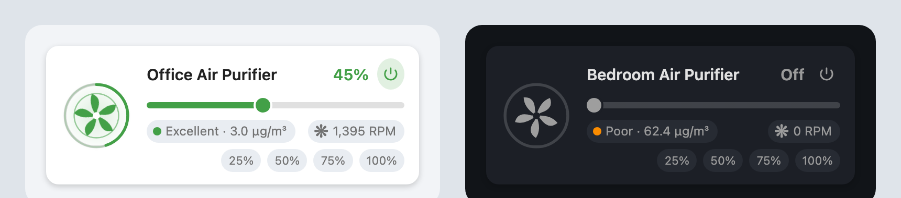
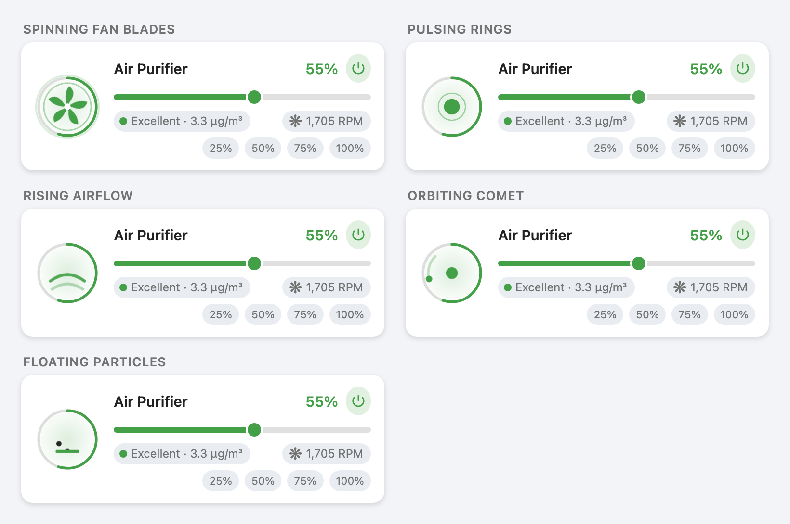

# Air Purifier Card

A compact, animated Lovelace card for a fan-based air purifier. The fan blades
spin faster as the speed goes up, and the whole card is tinted by the current
PM2.5 reading.




- Power toggle (tap the fan or the power button)
- 0–100 % speed slider + optional preset pills
- Live fan RPM and PM2.5 chips (tap for more-info)
- Five animations to pick from, all following the fan speed
- Accent colour follows air quality (Excellent → Hazardous)
- No dependencies, no build step, works with the visual editor

## Installation

### HACS (recommended)

1. HACS → **Frontend** → ⋮ → **Custom repositories**
2. Add `https://github.com/iharosi/air-purifier-card`, category **Dashboard** (plugin)
3. Install **Air Purifier Card**, then reload your browser

### Manual

1. Copy `dist/air-purifier-card.js` to `<config>/www/air-purifier-card.js`
2. Settings → Dashboards → ⋮ → **Resources** → add
   `/local/air-purifier-card.js` as a **JavaScript module**

## Usage

```yaml
type: custom:air-purifier-card
name: Office Air Purifier
fan: fan.air_purifier_1_pwm_fan
rpm: sensor.air_purifier_1_fan_rpm
pm25: sensor.office_air_quality_sensor_pm_summary
```

## Options

| Option | Type | Default | Description |
| --- | --- | --- | --- |
| `type` | string | **required** | `custom:air-purifier-card` |
| `fan` | string | **required** | Entity in the `fan` domain (power + percentage) |
| `name` | string | friendly name | Title shown on the card |
| `rpm` | string | – | Sensor with the fan speed in RPM |
| `pm25` | string | – | Sensor with the PM2.5 value in µg/m³ |
| `animation` | string | `blades` | Dial animation, see below |
| `show_presets` | boolean | `true` | Show the preset speed pills |
| `presets` | list | `[25, 50, 75, 100]` | Preset percentages |
| `preset_align` | string | `right` | Preset row alignment: `left`, `center` or `right` |

## Animations

Every animation runs only while the purifier is on and follows the fan
percentage: the higher the speed, the faster it moves.



| `animation` | What it looks like |
| --- | --- |
| `blades` (default) | The fan blades turn, with airflow rings around the dial |
| `pulse` | Rings breathe outwards from the centre |
| `waves` | Airflow arcs sweep upwards through the dial |
| `orbit` | A comet runs around the dial |
| `particles` | Dust rises off the intake |

```yaml
type: custom:air-purifier-card
fan: fan.air_purifier_1_pwm_fan
rpm: sensor.air_purifier_1_fan_rpm
pm25: sensor.office_air_quality_sensor_pm_summary
animation: waves
preset_align: center
```

## Air quality colours

| PM2.5 (µg/m³) | Label | Colour |
| --- | --- | --- |
| ≤ 12 | Excellent | green |
| ≤ 35 | Good | lime |
| ≤ 55 | Moderate | yellow |
| ≤ 150 | Poor | orange |
| ≤ 250 | Unhealthy | red |
| > 250 | Hazardous | purple |

## Development

There is no build step — `dist/air-purifier-card.js` is the shipped file.
Open `preview.html` in a browser to see the card with a mocked `hass` object.

## License

MIT
